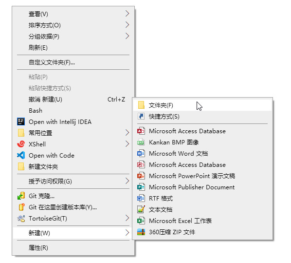
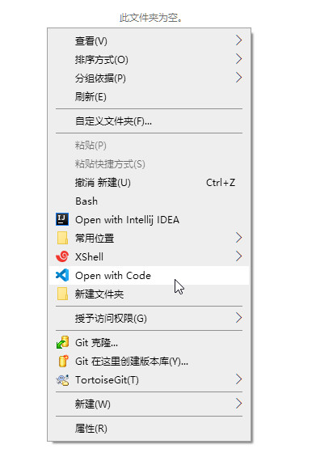
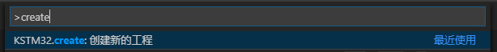
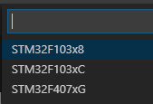
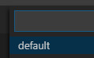
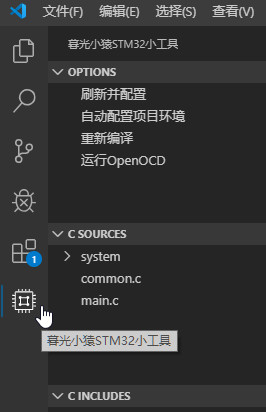
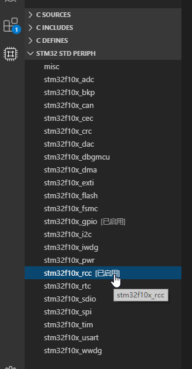
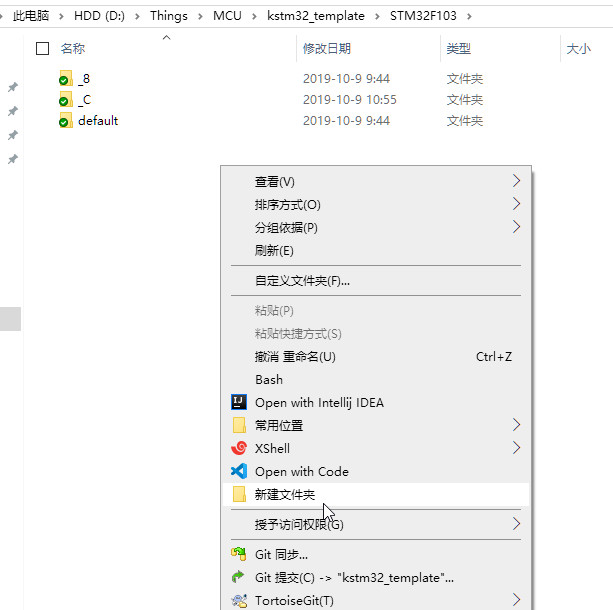

# 暮光小猿STM32小工具 kstm32

**本文档适用插件版本: kstm32 0.2.4**

## 为什么要写这个插件

```
为了简化VSCode+GCC开发STM32时的工程环境配置
顺便提供一些常用功能
```


## 如何开始

### 1. 安装本插件

```
在VSCode的Extensions里搜索"kstm32", 安装本插件
应该不用解释了
```

### 2. 基本环境配置

```
下载地址伸手链接 (可能有些内容已过时,上传时是0.0.1版本插件)
[度盘]https://pan.baidu.com/s/11te7jUyUf_vH8_hdC2wtrA&shfl=sharepset
```


1. #### 下载配套的工程模板

    ```
    GitHub: https://github.com/kuresaru/KSTM32_Templates
    尽量从GitHub工程Clone下来, 如果以后模板有更新, 可以直接pull.
    ```


2. #### 下载ST官方的标准外设库

    ```
    F10x和F4xx两个库, 用哪个下载哪个, 可以去ST官方, 也可以去上边的伸手链接.
    ```


3. #### 下载arm-none-eabi-gcc

    ```
    推荐2019版本. 可以去arm官方下载, 也可以去上边的伸手链接.
    最好把系统的PATH环境变量配置到工具的bin目录下
    ```


4. #### 安装GNU make工具

    ```
    Linux就不用说了吧
    Windows的我把官方源码编译了一份, 已经上传到伸手链接了
    下载exe文件后最好配置好环境变量
    注意不要使用MinGW msys自带的make.exe
    注意不要使用MinGW msys自带的make.exe
    注意不要使用MinGW msys自带的make.exe
    ```


5. #### 安装OpenOCD

    ```
    推荐使用最新的0.10版本
    下载后配置PATH环境变量到bin目录
    本插件调用了cortex-debug插件进行程序下载和调试
    ```


### 3. 编辑必要的插件配置

```
文件 -> 首选项 -> 设置 -> 扩展 -> 暮光小猿STM32小工具
```


* #### Libs: STM32F10x StdPeriph

    ```
    这个是从ST官方下载下来的STM32F10x的标准外设库路径, 如果你不使用库开发, 可以忽略.
    复用库是为了避免一个工程一份库, 占用磁盘空间.
    路径中应该含有"CMSIS"和"STM32F10x_StdPeriph_Driver"目录(官方下载压缩包里的"Libraries"目录).
    配置示例: D:\Things\MCU\STM32_Libs\STM32F10x_StdPeriph_Lib_V3.5.0\Libraries
    ===
    官方的库一定要用模板的patch目录中的core_cm3.c替换库中的原文件 否则无法编译通过.
    官方的库一定要用模板的patch目录中的core_cm3.c替换库中的原文件 否则无法编译通过.
    官方的库一定要用模板的patch目录中的core_cm3.c替换库中的原文件 否则无法编译通过.
    ===
    ```


* #### Libs: STM32F4xx StdPeriph

    ```
    同上, 从ST官方下载下来的STM32F4标准外设库
    路径中应该含有"CMSIS"和"STM32F4xx_StdPeriph_Driver"目录(官方下载压缩包里的"Libraries"目录).
    配置示例: D:\Things\MCU\STM32_Libs\STM32F4xx_DSP_StdPeriph_Lib_V1.8.0\Libraries
    ```


* #### Libs: Templates

    ```
    本工具配套的模板文件的路径.
    配置示例: D:\Things\MCU\kstm32_template
    ```


### 4. 可选的配置项

1. #### GCC Home

    ```
    gcc工具的根目录, 包含"arm-none-eabi", "bin", "lib", "share"四个目录.
    如果你没有配置GCC的环境变量, 那么一定要配置这个选项.
    ```


2. #### Make

    ```
    make工具的位置, 一般是为Windows系统配置的.
    填下载到的make.exe的文件路径.
    当然配置了make的环境变量后可以为空
    ```


3. #### OCD Scripts

    ```
    OpenOCD的scripts目录路径.
    用于调试启动
    ```


### 5. 新建一个工程

1. #### 新建一个普通的目录, 并用VSCode打开目录.

    

    


2. #### 按Ctrl+Shift+P运行命令

    


3. #### 选择工程类型(芯片型号)

    


4. #### 选择模板

    


5. #### 从左边打开KSTM32菜单

    


6. #### 从下边单击需要使用的标准外设库

    


7. #### 开始你的工程

    ```
    所有工程文件都写到src目录中, 
    本插件会自动递归识别并把你的工程文件(.c/.h/.s)配置到Makefile和vscode语法检查配置中.
    ```


8. #### 编译工程

    ```
    对项目结构进行更改后需要先点击右上角的"刷新项目环境"按钮
    然后点击右上角的"生成"按钮进行编译
    ```


### 6. 调试
    
    编译完成后点击右上角的"运行调试"按钮,本插件自动生成配置并调用cortex-debug进行调试.
    也可以在launch.json里增加kstm32启动配置
    注意: 如果修改并重新编译了执行文件, 那么需要重新启动调试, 重新运行(复位)无效.


### 8. 自定义工程模板 (不推荐,模板结构随插件更新)

1. #### 创建模板文件

    在创建新工程时只有一个默认"default"模板.

    打开模板目录, 在"default"同级创建一个空目录.

    

    在新目录中放入新的工程模板, 注意只放入通用的部分, 不要放入芯片特有的部分(如x8(md)和xC(hd)的启动.s文件).

    如果要新建一个芯片特有部分的模板(如新增对x6芯片的支持) \[注意:本功能未测试, 可能无法正常支持].

    那么需要在"default"同级目录中新建"_6"目录, 在目录中以模板相同结构放入文件.

    最终新建出来的工程 = 模板中的文件 + 芯片特有的文件 (两个都有的文件以芯片特有为准).

    可以以默认模板为例参考.


2. #### 编辑模板Makefile

    在适当位置(一般为文件开头)加入
    ```
    include kstm32-makefile-autogen.mk
    ```
    自动生成文件提供的变量:
    - TARGET: 最终文件的文件名, 创建项目时默认为目录名
    - C_SOURCES: 所有.c文件的路径
    - C_DEFS: 所有的Define
    - C_INCLUDES: 所有的Include路径
    - ASM_SOURCES: 所有的.s文件路径


## Bug反馈/交流/其它

小猿山庄/QQ群: 367341477

Bilibili: https://space.bilibili.com/15858903

个人网站: http://www.scraft.top


