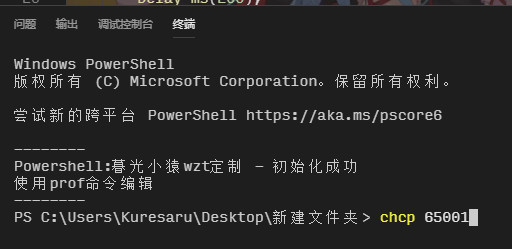
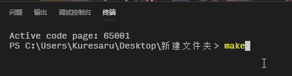
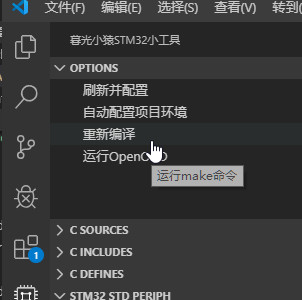

# 暮光小猿STM32小工具 kstm32

## 为什么要写这个插件
为了简化VSCode+GCC开发STM32时的项目环境配置
顺便提供一些常用功能

## 如何开始
### 1. 安装本插件
在VSCode的Extensions里搜索"kstm32", 安装本插件
应该不用解释了

### 2. 基本环境配置
下载地址伸手链接 https://pan.baidu.com/s/11te7jUyUf_vH8_hdC2wtrA&shfl=sharepset
###### 1. 下载配套的项目模板
GitHub: https://github.com/kuresaru/KSTM32_Templates
尽量从GitHub项目Clone下来, 如果以后模板有更新, 可以直接pull.
###### 2. 下载ST官方的标准外设库
F10x和F4xx两个库, 用哪个下载哪个, 可以去ST官方, 也可以去上边的伸手链接.
###### 3. 下载arm-none-eabi-gcc
推荐2019版本. 可以去arm官方下载, 也可以去上边的伸手链接.
最好把系统的PATH环境变量配置到工具的bin目录下
###### 4. 安装GNU make工具
Linux就不用说了吧, Windows的我把官方源码编译了一份, 已经上传到伸手链接了
下载exe文件后最好配置好环境变量
###### 5. 安装OpenOCD
如果你用的Windows系统, 你也可以不安装这个工具, 直接使用STLink等工具下载程序, 但是不能调试是肯定的
推荐使用最新的0.10版本
下载后配置PATH环境变量到bin目录

### 3. 编辑必要的插件配置
文件 -> 首选项 -> 设置 -> 扩展 -> 暮光小猿STM32小工具

###### Libs: STM32F10x StdPeriph
这个是从ST官方下载下来的STM32F10x的标准外设库路径, 如果你不使用库开发, 可以忽略.
复用库是为了避免一个项目一份库, 占用磁盘空间.
路径中应该含有"CMSIS"和"STM32F10x_StdPeriph_Driver"目录(官方下载压缩包里的"Libraries"目录).
配置示例: D:\Things\MCU\STM32_Libs\STM32F10x_StdPeriph_Lib_V3.5.0\Libraries

###### Libs: STM32F4xx StdPeriph
同上, 从ST官方下载下来的STM32F4标准外设库
路径中应该含有"CMSIS"和"STM32F4xx_StdPeriph_Driver"目录(官方下载压缩包里的"Libraries"目录).
配置示例: D:\Things\MCU\STM32_Libs\STM32F4xx_DSP_StdPeriph_Lib_V1.8.0\Libraries

###### Libs: Templates
本工具配套的模板文件的路径.
配置示例: D:\Things\MCU\kstm32_template

### 4. 可选的配置项
###### 1. GCC Home
gcc工具的根目录, 包含"arm-none-eabi", "bin", "lib", "share"四个目录.
如果你没有配置GCC的环境变量, 那么一定要配置这个选项.
(Windows暂不支持本选项, 请配置环境变量)
###### 2. Make
make工具的位置, 一般是为Windows系统配置的.
填下载到的make.exe的文件路径.
当然配置了make的环境变量后可以为空
###### 3. OpenOCD
如果不使用本插件一键启动OpenOCD, 可为空.
OpenOCD的根路径, 包含"bin", "contrib", "doc", "scripts"等目录.
Windows如果配置了环境变量, 可以为空.
有些Linux会把可执行文件链接到如"/bin"等目录, 那么必须配置本选项, 并保证有"bin"和"scripts"目录.

### 5. 新建一个项目
###### 1. 新建一个普通的目录, 并用VSCode打开目录.

###### 2. 按Ctrl+P运行命令

###### 3. 选择工程类型(芯片型号)

###### 4. 选择模板

###### 5. 从左边打开KSTM32菜单

###### 6. 从下边单击需要使用的标准外设库

###### 7. 开始你的项目
所有项目文件都写到src目录中, 本插件会自动识别并把你的工程文件(.c/.h/.s)配置到Makefile和vscode语法检查配置中.
###### 8. 编译项目
手动: 打开一个终端, 输入make编译. (Windows终端改UTF8的方法: chcp 65001)

自动(暂时有问题, 总是会重新编译所有工程文件):

### 6. 调试
调试相关的可以参考旧模板或参考c语言的启动配置, 配置gdb启动.
可以使用本插件一键启动OpenOCD, 使用ST-Link_v2方式连接.
或者推荐一下Cortex-debug这个插件(虽然启动比较慢, 不过人家这是专业的, 我就不再写这种功能了)

### 7. 自定义项目模板
在创建新工程时只有一个默认"default"模板.
打开模板目录, 在"default"同级创建一个空目录.

在新目录中放入新的工程模板, 注意只放入通用的部分, 不要放入芯片特有的部分(如x8(md)和xC(hd)的启动.s文件).
如果要新建一个芯片特有部分的模板(如新增对x6芯片的支持) \[注意:本功能未测试, 可能无法正常支持].
那么需要在"default"同级目录中新建"_6"目录, 在目录中以模板相同结构放入文件.
最终新建出来的工程 = 模板中的文件 + 芯片特有的文件 (两个都有的文件以芯片特有为准).
可以以默认模板为例参考.

### 8. Bug反馈/交流/其它
小猿山庄/QQ群: 367341477
Bilibili: https://space.bilibili.com/15858903
个人网站: http://www.scraft.top

